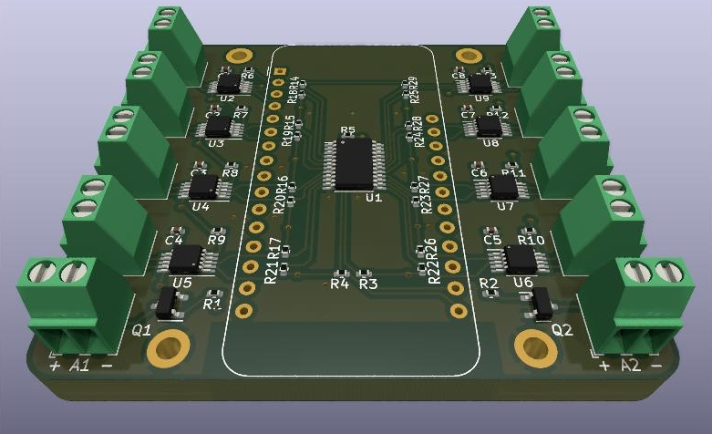

# HapticESP32

This PCB provides a maximum of eight ERM/LRA drivers and two transistors to control binary actuators.
All haptic actuators can be controlled through an [Adafruit Feather HUZZAH32](https://www.adafruit.com/product/3405) microcontroller.

All SMDs are on one-side of the PCB only to reduce costs for the assembly service.

This board was designed using [KiCad 6.0](http://www.kicad.org).

## Design

## Parts
The part list is divided into two sections, the first one contains the parts if you decide to only solder the through-hole components yourself. The second BOM contains the SMD components.

### Through-hole components
Part                   | Quantity | Description
-----------------------|----------|-----------------------
Feather HUZZAH32       | 1        | ESP32 Microcontroller
Phoenix MPT-0,5-2-2.54 | 10       | 2-pin Terminalblock

### SMD components
Part               | Quantity | Description
-------------------|----------|-----------------
TCA9548APWR        | 1        | I2C Multiplexer
DRV2605LDGSR       | 8        | ERM/LRA Driver
MMBT5550LT1G       | 2        | NPN Transistor
Resistor 0402 1k   | 2        | Generic Resistor
Resistor 0402 4.7k | 27       | Generic Resistor
Capacitor 0402 1uF | 8        | Generic Capacitor

## License
 This work is licensed under a <a rel="license" href="http://creativecommons.org/licenses/by/4.0/">Creative Commons Attribution 4.0 International License</a>.
